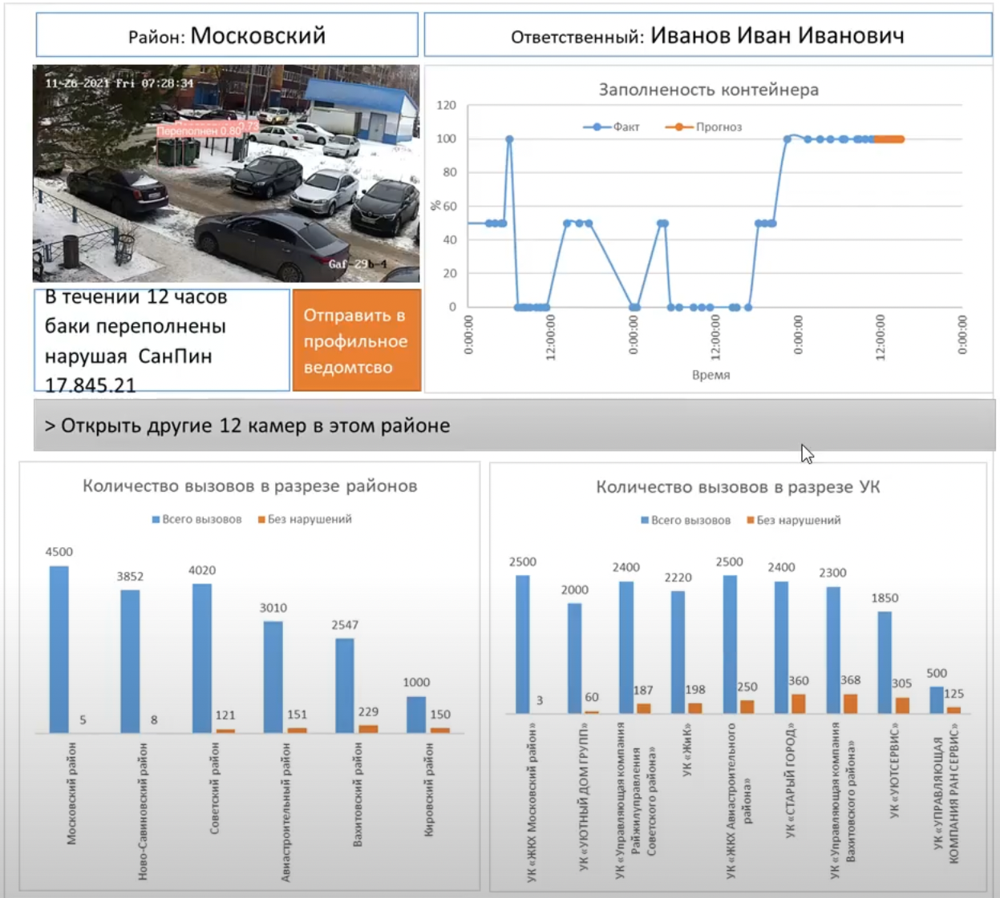

Разработанное решение помогает жителям города следить за безопасностью и чистотой во дворах, планировать работу обслуживающих организаций за счёт статистического анализа данных.

Решение, в основе которого используется искусственный интеллект, позволяет решать следующие задачи:
- Контролировать заполненность контейнеров для мусора
- Детектировать возгарания и пожары во дворах
- Собирать статистику по вывозу мусора
- Давать предложения по измению графика вывоза мусора в каждом дворе, где установлены камеры

Стек решения: python, yolo, folium, streamlit.

Уникальность решения заключается в том, что оно позволяет получать отчёты на основе статистического анализа данных с уличных камер, повысить скорость реагирования профильных служб на инциденты, связанные с загрязнениями и возгараниями на территории жилих дворов. 

Сроки разработки: 3 месяца (разработка пилотной версии) + 6-12 месяцев (пилотные испытания и доработка) + 3-6 месяцев (промышленное внедрение).

Стоимость разработки: 
- 0,5 млн руб (разработка пилотной версии) 
- 2 млн руб (пилотные испытания и доработка) 
-  1 млн руб (промышленное внедрение)


## Установка и запуск приложения
>Примечание: В репозиторий не была загружена модель нейронной сети с весами, в связи с тем, что она занимает достаточно большой объем памяти хранилища. Поэтому необходимо воспользоваться [ссылкой](https://drive.google.com/drive/folders/1GngMurVoAZ-4tjBJWCziYvHtdw25lfC7?usp=sharing) для скачивания весов модели и выполнить [инструкции](https://github.com/waico/smart_city_kazan/blob/main/YOLO5_Train_Inference/readme.md), размещённые в папке `YOLO5_Train_Inference` репозитория. После подготовки модели, необходимо выполнить следующие действия:
- скачайте все содержимое папки GUI
- установите библиотеку `streamlit`
```terminal
pip install streamlit
```
- установите дополнительные библиотеки, необходимые для работы приложения из файла requirements.txt в скачанной папке GUI, используя команду:
	pip install -r requirements.txt 
- находясь в корневой директории репозитория выполните команду:  
```terminal
streamlit run app_fol5.py
```
автоматически откроется окно браузера и в нём загрузится сраница приложения


В центре приложения - карта города, на которой пользователь видит камеры, расположенные в разных местах. Камеры окрашены разными цветами в зависимости от текущей ситуации на месте: 
- обнаружено переполнение мусорных баков, мусор лежит на дороге или урна переполнена, произошло возгорание мусора или машины на парковке - камера будет красной, 
- всё в порядке - камера будет зелёной.

По каждой камере пользователь может получить подробный аналитический отчет нажав на соответствующую кнопку ниже (планировалось реализовать с помощью ссылки при наведении на камеру).



После изучения камер пользователь может нажать на кнопку, находяющуюся в нижней части приложения, чтобы выбрать камеры, по которым обнаружены превышения в мусорных контейнерах и загрузить изображения с них. После нажатия на кнопку выполнится автоматический анализ полученных снимков с камер на которых будут отмечены проценты заполненности мусорных баков с выделением самих баков с помощью bounding boxes.


Скринкаст приложения доступен по ссылке - https://drive.google.com/file/d/1hL9Wuo9yvklfcD44p85gNL73YZfNW7yA/view?usp=sharing


## Структура репозитория
```
|-GUI                    - исходный код приложения
|-OCR + geo_extract      - применение OCR к доступным картинкам для извлечения времени и адреса. Обработка исходных данных по связке адресов и папок исходных данных. Пайплайн извлечение ширины и долготы по адресу
|-YOLO5_Train_Inference  - ноутбуки для обучения и инференса моделей, также содержит директорию weights с весами модели
|-macro_micro_analytics  - BI и анализ временных рядов загрузки контейнеров
|-parser                 - автоматические сохранение картинок по яндексовому запросу, для обогащения датасета
|-stream_video           - интеграция стриминг видео
```

## Описание используемой модели
На основании внутреннего конкурса по качеству моделей из `YOLO5X,YOLO5S,YOLO5I,ResNET_v2` была выбрана `YOLO5X`. Значение метрики f1_weighted = 0.922 на отложенной выборке.